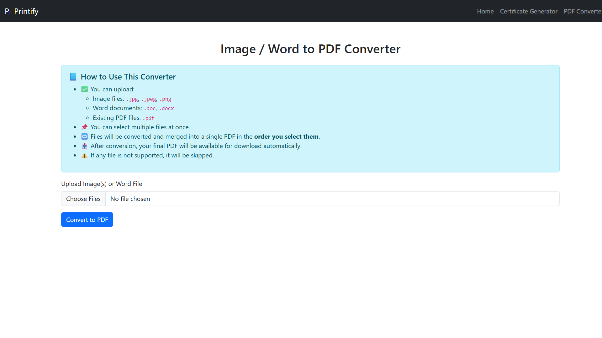

# 🖨️ Printify

**Printify** is a lightweight web application to generate personalized certificates from a template image and convert image/Word files into PDFs — all in one place!

---

## 🚀 Features

- 🎓 Certificate Generator from templates
- 🖼️ Convert images or Word files into PDFs
- 📄 Merge multiple PDF files
- ⚙️ Interactive canvas to preview and set text position
- 🧠 No login required – easy and fast
- 📱 Responsive design (works on mobile and desktop)

---

## 🛠️ Built With

- Python + Flask
- HTML, CSS (Bootstrap 5)
- JavaScript
- Pillow (PIL)
- ReportLab / FPDF for PDF generation

---

## 📸 Screenshots

### 🏠 Home Page


### 🖋️ Certificate Generation Page


### 🗃️ PDF Converter and Merger


---

## ⚙️ How to Run Locally

1. **Clone the repository**  
```bash
git clone https://github.com/Preethinthran/printify.git
cd printify
```

2. **Create a virtual environment**  
```bash
# Windows
python -m venv venv
venv\Scripts\activate

# Mac/Linux
python3 -m venv venv
source venv/bin/activate
```

3. **Install dependencies**  
```bash
pip install -r requirements.txt
```

4. **Run the app**  
```bash
python app.py
```

Then open your browser and go to:  
👉 [http://localhost:5000](http://localhost:5000)

---

## 👨‍💻 Author

Developed with ❤️ by [S. Preethinthran](https://github.com/Preethinthran)

---
